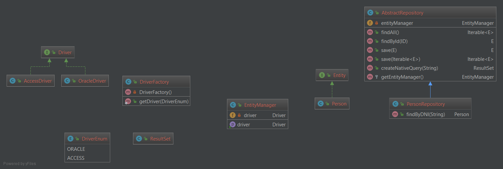

# QTFKdata

## Synopsis

The purpose of this library is to save time coding the data access layer of your application.
This library will generate your CRUD classes... 
 - at runtime
 - independent from database engine
 - specifying only the interface

## Motivation

The data access is a common layer in many applications. Like in [QTFK libraries](https://github.com/hossmi/qtfk "Quick Tools for Funny Koding"), the main motivation of this library, it is to help developers, avoiding to invest so much time on the construction of this layer.

## What this library offers

This library allows you to get a CRUD repository only specifying an interface class. 
Only writing the next interface... 

```csharp
	public interface IProductRepository : ICRUDRepository<Product> 
	{
	}
```

...we will get the implementation for it:

```csharp
	// ...
	public SomeClassConstructor(IProductRepository repo) // <==== provided by D.I.
	{
		// ...
		_productRepository = repo;
		// ...
	}
	// ...
```

## Code Example

Let's generate a Product repository. Suppose we have the next Product class:
```csharp
	//Product class
	public class Product
	{
		public int ID { get; set; }
		public string Name { get; set; }
		public decimal Price { get; set; }
		public DateTime Creation_date { get; set; }
		public string Description { get; set; }
	}
```

We can create an interface that inherits from **ICRUDRepository<T>**. This base interface already defines basic CRUD operations like GetByID, Add, Set and Remove. _There is no need_ for implementing the **IProductRepository** interface.

```csharp
	public interface IProductRepository 
	    : ICRUDRepository<Product>
	{
		IEnumerable<Product> GetByPriceBetween(decimal min, decimal max);
		IEnumerable<Product> GetByDescription(string description);
	}
```

At dependency injection engine setup, like AutoFac or OWin, we need to call the repositories factory for to build types for those interfaces that inherits from **ICRUDRepository<T>**. There is no need for maintaining this code fragment.
```csharp
	//...
	IDBIO db = new SQLServerDBIO("some connection string");
	ICRUDFactory crudFactory = new SqlServerCrudFactory(db);
	var crudRepositoryBuilder = new DefaultCRUDRepositoryExplorer(crudFactory);
	var repositories = crudRepositoryBuilder.Build();
	//...
```

Finally, dependency injection engine will provide instances of your repositories.
```csharp
	//some client class
	public class ProductController : Controller
	{
		private readonly IProductRepository _productRepository;

		//constructor depends on IProductRepository
		public ProductController(IProductRepository productRepository)
		{
			_productRepository = productRepository;
		}
		
		public Index()
		{
			//call method from at-runtime generated class
			var items = _productRepository
				.GetByPriceBetween(500m, 1000m);
			//...
		}
	}
```

## Documentation



## Installation

_Initial version not yet released._
Just download the zip with the latest release, unzip it into your projects and reference it.
_The intention it is to build a nuget package for an easier installation._

## Tests

The solution includes a MS Test project for testing each feature. You will need to provide a connection string to the data base.

## Contributors

Many thanks to [Ginxo](https://github.com/Ginxo) for his awesome knowledge and tips, contributing on the design of this library.

## License

This project is under [MIT](https://github.com/hossmi/qtfkdata/blob/develop/LICENSE "View the license") license.